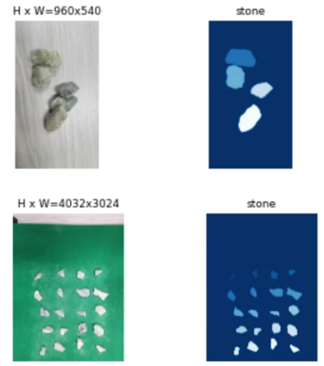

# Mask-RCNN-with-custom-datasets
A-Z for using Mask RCNN with your custom dataset

***
## 1. Anaconda Setting
We control our packages by using Anaconda\
You can set your anaconda setting [[here]](https://github.com/gmac7892/Ubuntu-Anaconda-Setting)

    $ conda create -n MRCNN python=3.6 pip
    Proceed ([y]/n)? Select "y"
    $ conda activate MRCNN
    $ conda install –c anaconda git
    $ pip install tensorflow-gpu==1.13.1
    $ pip install keras
    $ pip install numpy scipy cython Matplotlib h5py Pillow scikit-image jupyter pandas
    $ pip install opencv-python ipython
    $ pip install imgaug
***
## 2. Requirment Packages

* labelme [[link]](https://github.com/wkentaro/labelme)
* clodsa [[link]](https://github.com/joheras/CLoDSA)

## 3. Install our Package

    $ git clone https://github.com/gmac7892/Mask-RCNN-with-custom-datasets.git
    
***
## 4. Usage
* make your annotation file(.json) by using labelme

* save your image and annotation files in __'original_train'__, and __'original_val'__
* Delete __'train_coco'__, and __'val_coco'__ files.\
Execute the command within scrap.txt from terminal one by one. -> you can check new __'train_coco'__, and __'val_coco'__
* Delete __'train2020'__, and __'val2020'__ files.\
Execute jupyter notebook in terminal, open __'augmentation.ipynb'__ and execute all cells

* __"Now you can ready to use Mask R-CNN for your custom dataset!!"__

* __"Let's see the 'demo.ipynb' and customize your learning"__
